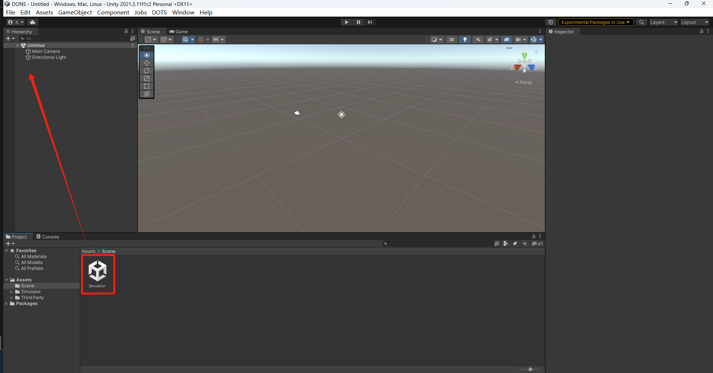
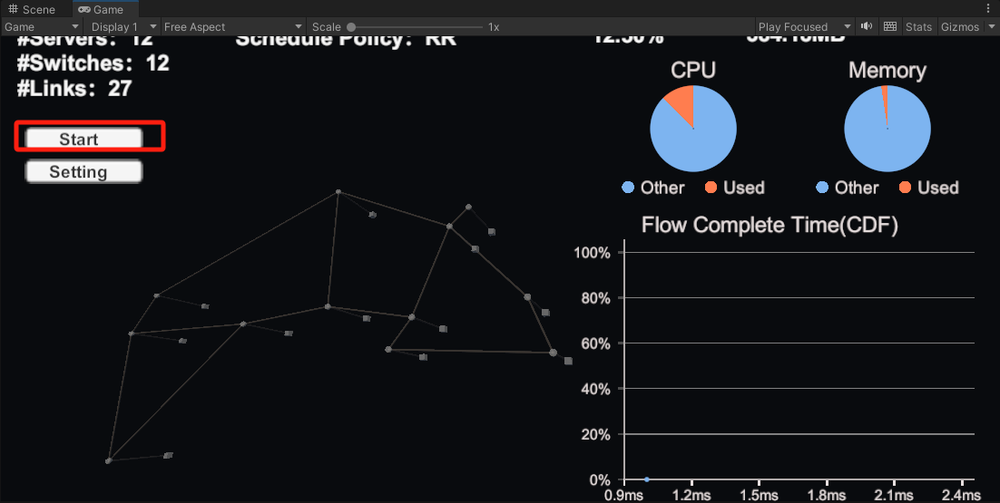
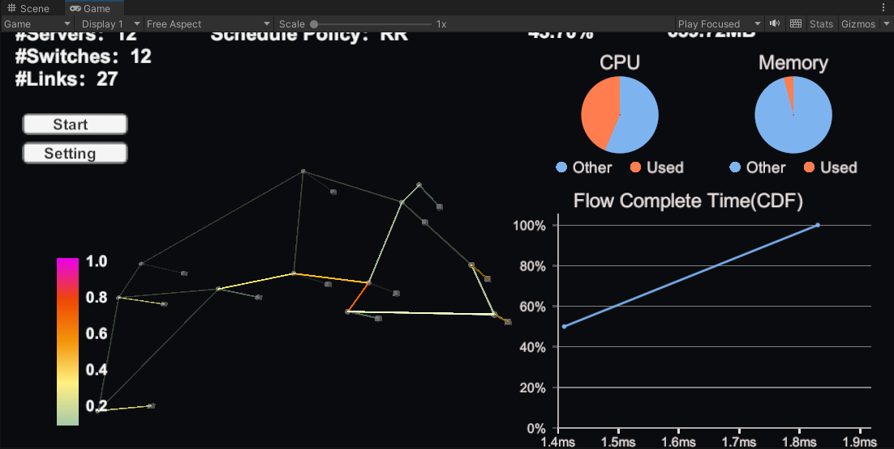
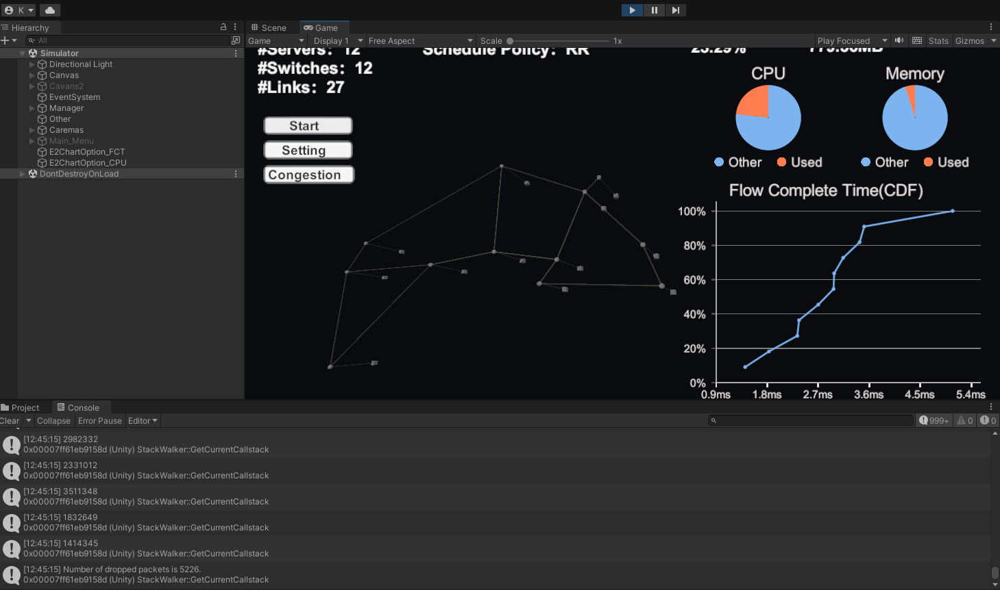

# DONS: Fast and Affordable Discrete Event Network Simulation with Automatic Parallelization

DONS features a data-oriented and multi-threaded simulation engine that can perform automatic parallelization within a server, achieve high core utilization, low cache miss rate, and high memory efficiency, simultaneously. 

For a cluster of servers, DONS also has a novel simulation partitioning algorithm that can assist balanced parallelization. 

SIGCOMM'23 paper: https://dl.acm.org/doi/10.1145/3603269.3604844

# Installation guide

1. Git clone this project.
2. Open Unity Hub -> Projects -> Open -> Choose folder "DONS".
3. Open "DONS" with Unity Editor (version: 2021.3.11f1).
4. Open the Package Manager (menu: **Window** > **Package Manager**).
5. Click the small gear icon on the upper right and select the **Advanced Project Settings** menu item.
6. Check **Enable Preview Packages** in the Project Settings window.
7. In the Package Manager window, add the DOTS packages that you need by name from the package manager.

(These are the packages used when developing DONS.)

# Running in Unity Editor

1. Load scene Simulator.unity (Assets/Scene/Simulator.unity), i.e., drag the icon into the sidebar "Hierarchy", and remove the "Untitled" scene. The Unity Editor will compile the source code automatically.

2. Click this icon to run DONS.

3. Click "Start" to run a simple network simulation task.

Network topology:  Abilene.
Click "Setting" to change the topology and traffic demands.

4. Runtime:

The left side shows the link congestion, and the right side shows the flow completion time (FCT) in real time.

5. Results: 

Click "Congestion" to see the historical queue length data, and all the data is stored in log files.

# Folder descriptions
- Build_results: the compiled executable files, which can be run on a Linux server.
- Distributed: distributed execution module.
- DONS: the source code of the project.
- Images: images used in this document.
- traffic_gen: traffic demands generator module.

# Important links 

1. [Job system](https://github.com/Unity-Technologies/EntityComponentSystemSamples/blob/master/EntitiesSamples/Docs/jobs.md)
2. [Entities and components](https://github.com/Unity-Technologies/EntityComponentSystemSamples/blob/master/EntitiesSamples/Docs/entities-components.md)
3. [Systems](https://github.com/Unity-Technologies/EntityComponentSystemSamples/blob/master/EntitiesSamples/Docs/systems.md)
4. [Accessing entities in jobs](https://github.com/Unity-Technologies/EntityComponentSystemSamples/blob/master/EntitiesSamples/Docs/entities-jobs.md)
5. [Entity command buffers](https://github.com/Unity-Technologies/EntityComponentSystemSamples/blob/master/EntitiesSamples/Docs/entity-command-buffers.md)
6. [Transform components and systems](https://github.com/Unity-Technologies/EntityComponentSystemSamples/blob/master/EntitiesSamples/Docs/transforms.md)
7. [Baking and entity scenes](https://github.com/Unity-Technologies/EntityComponentSystemSamples/blob/master/EntitiesSamples/Docs/baking.md)
8. [Additional Entities features](https://github.com/Unity-Technologies/EntityComponentSystemSamples/blob/master/EntitiesSamples/Docs/additional-entities-features.md)

## 
